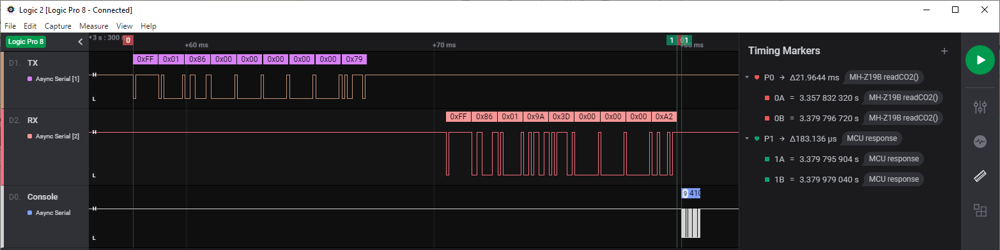

[](https://github.com/Erriez/ErriezMHZ19B/blob/master/LICENSE)
[](https://github.com/Erriez/ErriezMHZ19B)
[](https://github.com/Erriez/ErriezMHZ19B/releases)
[](https://github.com/Erriez/ErriezMHZ19B/issues)
[](https://github.com/Erriez/ErriezMHZ19B/actions/workflows/actions.yml)

# Erriez MH-Z19B/C CO2 sensor library for Arduino

This is a MH-Z19B / MH-Z19C CO2 sensor library for Arduino. It has been built from scratch to support hardware 
and software serial with a small footprint.

The MH-Z19 is a NDIR (Non-Dispersive Infrared) type gas sensor with built-in temperature
compensation to measure CO2 concentration in air.


## Library features

* Small code/memory footprint
* Hardware and software serial interface at 9600 baud 8N1
* Read CO2 concentration 400..5000 ppm +/-50ppm+3% minimum 5 seconds interval
* Chip detection
* Smart warming-up detection
* Read firmware version
* Set/get range 2000 or 5000 ppm
* Set/get auto calibration (Automatic Baseline Correction 24h interval)
* Manual 400ppm calibration command
* CRC checks on communication protocol and timeout handling
* Interface for sending undocumented commands

### Pins

```c++
// MH-Z19B front connector
//     __     _______
// +------------------+
// |                  |
// |   . . . . . . .  |
// |   1 2 3 4 5 6 7  |
// +------------------+
//
// Pin 1: Yellow  None
// Pin 2: Green   UART (TXD) TTL Level Data Output  -> TO RXD
// Pin 3: Blue    UART(RXD) TTL Level Data Input    -> TO TXD
// Pin 4: Red     Positive Power Supply (Vin +5V)
// Pin 5: Black   Negative Power Supply (GND)
// Pin 6: White   None
// Pin 7: Brown   Analog Output Vo (Not used)
//
// The following ESP8266 pins are reserved:
//    TX/RX:  Serial (in use)
//    A0:     Analog (cannot be used)
//    D0-RST: Wake (cannot be used)
//    D1/D2:  I2C (can be used when I2C not used)
//    D3:     Output data flash (corrupts MH-Z19B on boot)
//    D4:     Boot (in use by boot pin / LED)
//    D5..D8: SPI <- Can be used when SPI not used
```


## Tested Hardware

The following targets are supported and tested:

* AVR: UNO, MINI, Pro Mini 8/16 MHz, ATMega2560, Leonardo
* ARM: DUE
* ESP8266: Mini D1 & D2, NodeMCU
* ESP32: Lolin D32


## Examples

* [ErriezMHZ19BGettingStarted](https://github.com/Erriez/ErriezMHZ19B/tree/master/examples/ErriezMHZ19BGettingStarted) 
* [ErriezMHZ19BSerialPlottter](https://github.com/Erriez/ErriezMHZ19B/tree/master/examples/ErriezMHZ19BSerialPlottter)
* [ErriezMHZ19B7SegmentDisplay](https://github.com/Erriez/ErriezMHZ19B/tree/master/examples/ErriezMHZ19B7SegmentDisplay)


## Documentation

- [Online HTML](https://erriez.github.io/ErriezMHZ19B)
- [Doxygen PDF](https://github.com/Erriez/ErriezMHZ19B/blob/gh-pages/ErriezMHZ19B.pdf)
- [Datasheet PDF](https://github.com/Erriez/ErriezMHZ19B/blob/master/extras/mh-z19b-co2-ver1_0.pdf)


## CO2 Concentrations

The table below displays the human impact of CO2:

| CO2 ppm    | Description                                                  |
| ---------- | ------------------------------------------------------------ |
| 0..399     | Incorrect values. Minimum value starts at 400ppm outdoor fresh air. |
| 400..1000  | Concentrations typical of occupied indoor spaces with good air exchange. |
| 1000..2000 | Complaints of drowsiness and poor air quality. Ventilation is required. |
| 2000..5000 | Headaches, sleepiness and stagnant, stale, stuffy air. Poor concentration, loss of attention, increased heart rate and slight nausea may also be present. |
| >5000      | Higher values are extremely dangerous and cannot be measured by this sensor. |


## Usage

* Operating voltage is between 4.5 and 5VDC, 150mA peak current (average < 60mA).
* UART pins are compatible with processors running at 3.3V without level converters.
* Keep sensor outside direct sunlight.

### Calibration

The sensor requires an internal calibration regularly. Without it, the minimum value drifts away 
which is noticeable after a few weeks of operation. With my experiments, the minimum value was 
drifted to 800ppm after 3 months continues operation without a calibration.

There are two calibration options:

1. Automatic calibration, performed every 24 hours (default).
2. Manual calibration.

### 1. Automatic Calibration

Automatic calibration is recommended when the sensor cannot be moved outdoor with fresh air. This 
calibration method requires a regularly ventilated room at 400ppm, at least once in 1..3 weeks. 
Additionally, it requires continues power-up without interruptions, otherwise the calibration data 
will not be updated correctly.

Automatic calibration configuration:

* Set auto calibration on: `setAutoCalibration(true)` (Default from manufacture).
* Set auto calibration off: `setAutoCalibration(false)`.

The status can be read with function `getAutoCalibration()`.

**Note:**  
For simplicity, this library uses the terminology `Automatic Calibration` which is identical to the
`ABC (Automatic Baseline Correction) logic on/off` mentioned in the datasheet.

### 2. Manual Calibration (400ppm)

Procedure for manual calibration at 400ppm:

* Turn automatic calibration off.
* Power the sensor up outdoor in fresh air for at least 20 minutes. (Not in a forest or a farm 
  which produces background CO2)
* Call `startZeroCalibration()` once. This will send command `0x87 Zero Point Calibration`, but 
  is not a zero calibration as stated in the datasheet. There is no nitrogen needed as this 
  calibration is performed at 400ppm.

Now the sensor is calibrated. Repeat the sequence more often for higher accuracy.

### 3. Manual Calibration (SPAN)

The datasheet also mentions a command `0x88 Span Point Calibration`. The calibration procedure is
not clear and therefore not implemented in this library.


## MH-Z19B API

**Initialization Software Serial**

Use a Software Serial when no hardware serial is available. Sometimes a 3rd party library is
required, for example for ESP32 targets by installing `ESPSoftwareSerial`. It must be installed into 
`.arduino15/packages/esp32/hardware/esp32/<version>/libraries/EspSoftwareSerial`, because the 
library contains a naming conflict with existing `SoftwareSerial.h` built-in libraries.

```c++
#include <ErriezMHZ19B.h>
#include <SoftwareSerial.h>

// Pin defines
#define MHZ19B_TX_PIN        4
#define MHZ19B_RX_PIN        5

// Create software serial object
SoftwareSerial mhzSerial(MHZ19B_TX_PIN, MHZ19B_RX_PIN);

// Create MHZ19B object with software serial
ErriezMHZ19B mhz19b(&mhzSerial);
```

**Initialization Hardware Serial**

Any hardware serial like `Serial`, `Serial1`, `Serial2` etc can be used when supported by the CPU.
Multiple hardware serial ports are only available on targets like ATMEGA2560, Leonardo and SAM DUE 
boards:

```c++
#include <ErriezMHZ19B.h>

// Create MHZ19B object with hardware serial
ErriezMHZ19B mhz19b(&Serial1);
```

**General initialization**

The optional items of the initialization sequence can be omitted.

```c++
void setup()
{
    // Initialize serial
    Serial.begin(115200);
    Serial.println(F("\nErriez MH-Z19B CO2 Sensor example"));

    // Initialize software serial at fixed baudrate
    mhzSerial.begin(9600);

    // Optional: Detect MH-Z19B sensor (check wiring / power)
    while ( !mhz19b.detect() ) {
        Serial.println(F("Detecting MH-Z19B sensor..."));
        delay(2000);
    };

    // Sensor requires 3 minutes warming-up after power-on
    while (mhz19b.isWarmingUp()) {
        Serial.println(F("Warming up..."));
        delay(2000);
    };
}
```

**Read CO2 loop**

Read CO2 with minimum interval asynchronous function `isReady()`.
A good practice is to check error returns `< 0`.

```c++
void loop()
{
    int16_t result;

    // Minimum interval between CO2 reads
    if (mhz19b.isReady()) {
        // Read CO2 from sensor
        result = mhz19b.readCO2();

        // Print result
        if (result < 0) {
            // Print error code
            switch (result) {
                case MHZ19B_RESULT_ERR_CRC:
                    Serial.println(F("CRC error"));
                    break;
                case MHZ19B_RESULT_ERR_TIMEOUT:
                    Serial.println(F("RX timeout"));
                    break;
                default:
                    Serial.print(F("Error: "));
                    Serial.println(result);
                    break;
            }
        } else {
            // Print CO2 concentration in ppm
            Serial.print(result);
            Serial.println(F(" ppm"));
        }
    }
}
```

**Print internal settings**

All tests are performed with sensor version string `"0443"`.

```c++
char firmwareVersion[5];

// Optional: Print firmware version
Serial.print(F("  Firmware: "));
mhz19b.getVersion(firmwareVersion, sizeof(firmwareVersion));
Serial.println(firmwareVersion);

// Optional: Set CO2 range 2000ppm or 5000ppm (default) once
// Serial.print(F("Set range..."));
// mhz19b.setRange2000ppm();
// mhz19b.setRange5000ppm();

// Optional: Print operating range
Serial.print(F("  Range: "));
Serial.print(mhz19b.getRange());
Serial.println(F("ppm"));

// Optional: Print Automatic Baseline Calibration status
Serial.print(F("  Auto calibrate: "));
Serial.println(mhz19b.getAutoCalibration() ? F("On") : F("Off"));
```

**Set automatic calibration**

Turn automatic calibration on or off once at startup:

```c++
// Optional: Set automatic calibration on (true) or off (false) once
mhz19b.setAutoCalibration(true);
```


### Documented commands

The following commands are documented, used and tested by the library:

| Command | Description                                  |
| ------- | -------------------------------------------- |
| 0x79    | Set auto calibration on/off                  |
| 0x86    | Read CO2 concentration                       |
| 0x87    | Calibration zero point at 400ppm (not 0 ppm) |
| 0x88    | Calibrate span point (NOT IMPLEMENTED)       |
| 0x99    | Set detection range                          |


### Not documented commands (tested)

The following commands are **not documented**, are used and tested  by the library:

| Command | Description                                  |
| ------- | -------------------------------------------- |
| 0x7D    | Get auto calibration status (NOT DOCUMENTED) |
| 0x9B    | Get range detection (NOT DOCUMENTED)         |
| 0xA0    | Get firmware version (NOT DOCUMENTED)        |

More information about undocumented commands: https://revspace.nl/MH-Z19B.

**NOTE:** Sending untested commands may damage the sensor permanently! Use at your own risk.

```c++
int16_t result;

result = mhz19b.sendCommand(MHZ19B_CMD_NOT_DOCUMENTED, 0x00, 0x00, 0x00, 0x00, 0x00);

// 9 Bytes response is located in mhz19b.rxBuffer[9]
```


## Library configuration

Unfortunately, the sensor has no possibility to read warming-up status, so the library must wait
at least 3 minutes after reset or power-on. To speedup the boot process, macro 
`MHZ19B_SMART_WARMING_UP` can be enabled in `ErriezMHZ19B.h` to enable smart warming-up when the 
MCU is reset and MH-Z19B powered > 3 minutes.


## Response timing

The screenshot below displays the response timing of a synchronous readCO2() call which takes 22.1ms
on an Arduino UNO:
* 9.4ms: Transmit 9 Bytes at 9600 baud
* 3.2ms: MH-Z19B to process command
* 9.3ms: Return response 9 Bytes at 9600 baud
* 183us: Arduino UNO to process response with Software Serial. 




## Library installation

Please refer to the [Wiki](https://github.com/Erriez/ErriezArduinoLibrariesAndSketches/wiki) page.


## Other Arduino Libraries and Sketches from Erriez

[Erriez Libraries and Sketches](https://github.com/Erriez/ErriezArduinoLibrariesAndSketches)


## MIT License

This project is published under [MIT license](https://github.com/Erriez/ErriezMHZ19B/blob/master/LICENSE)
with an additional end user agreement (next section).


## End User Agreement :ukraine:

End users shall accept the [End User Agreement](https://github.com/Erriez/ErriezMHZ19B/blob/master/END_USER_AGREEMENT.md)
holding export restrictions to Russia to stop the WAR before using this project.
