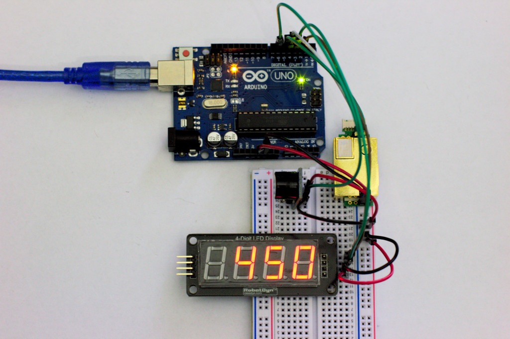
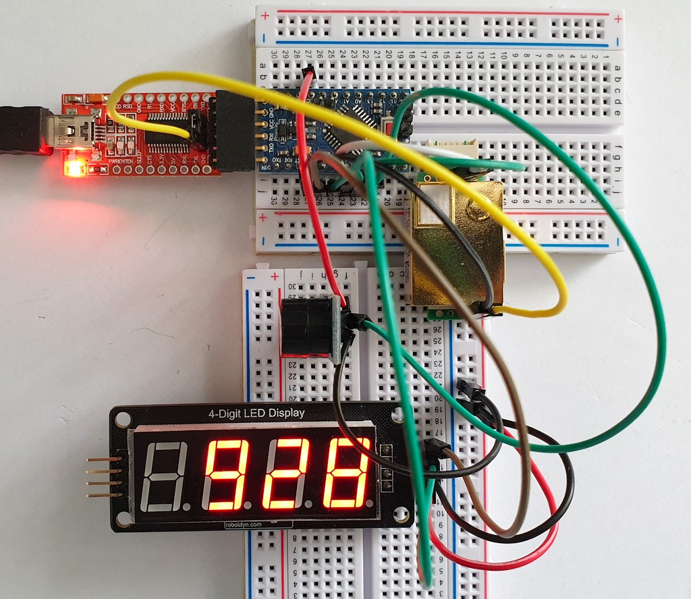
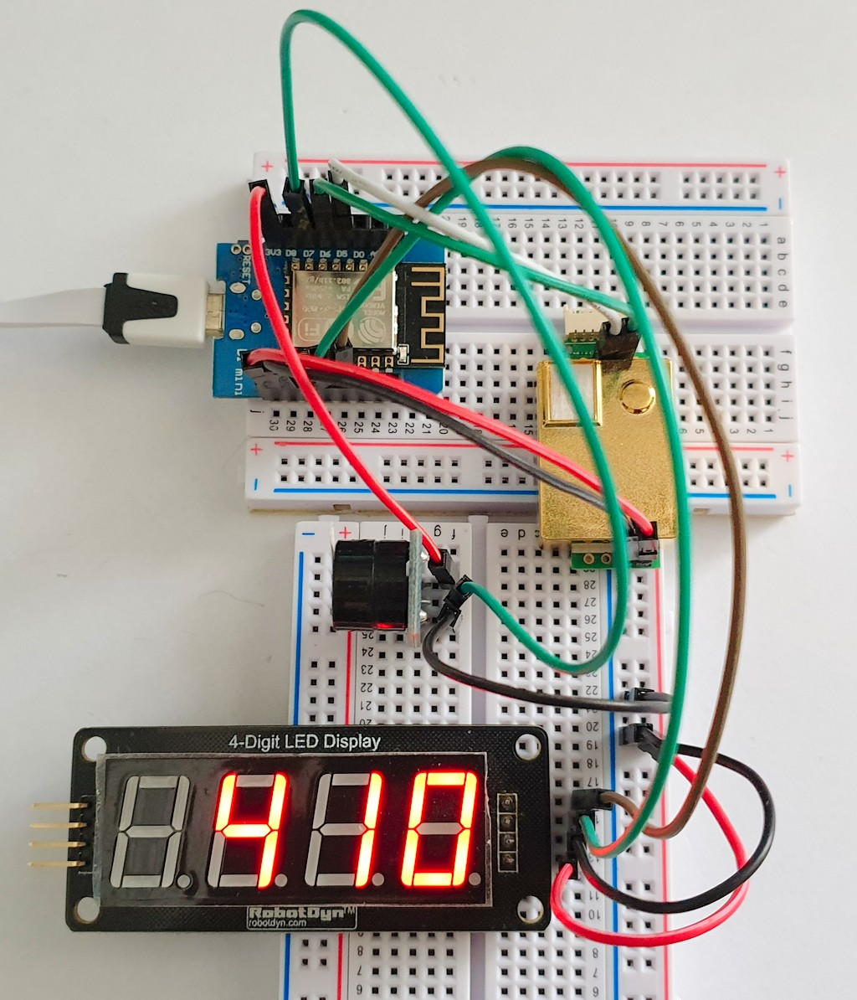
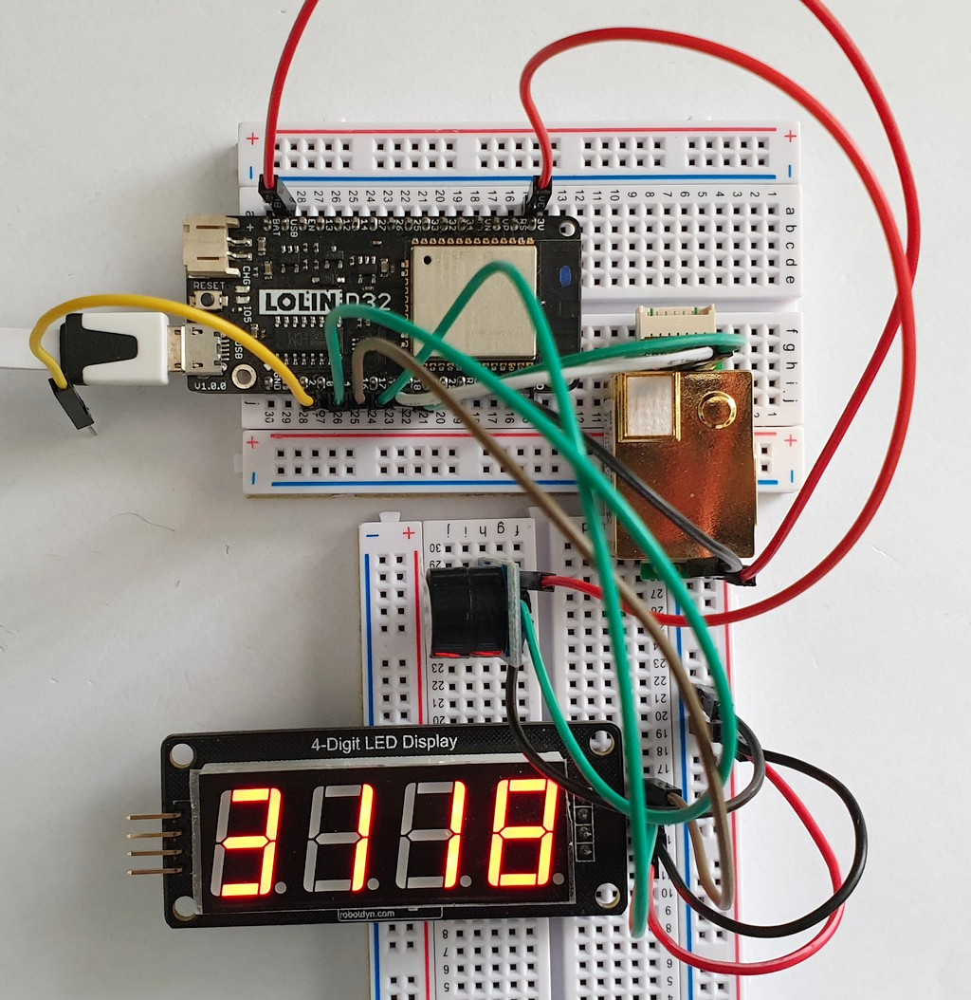
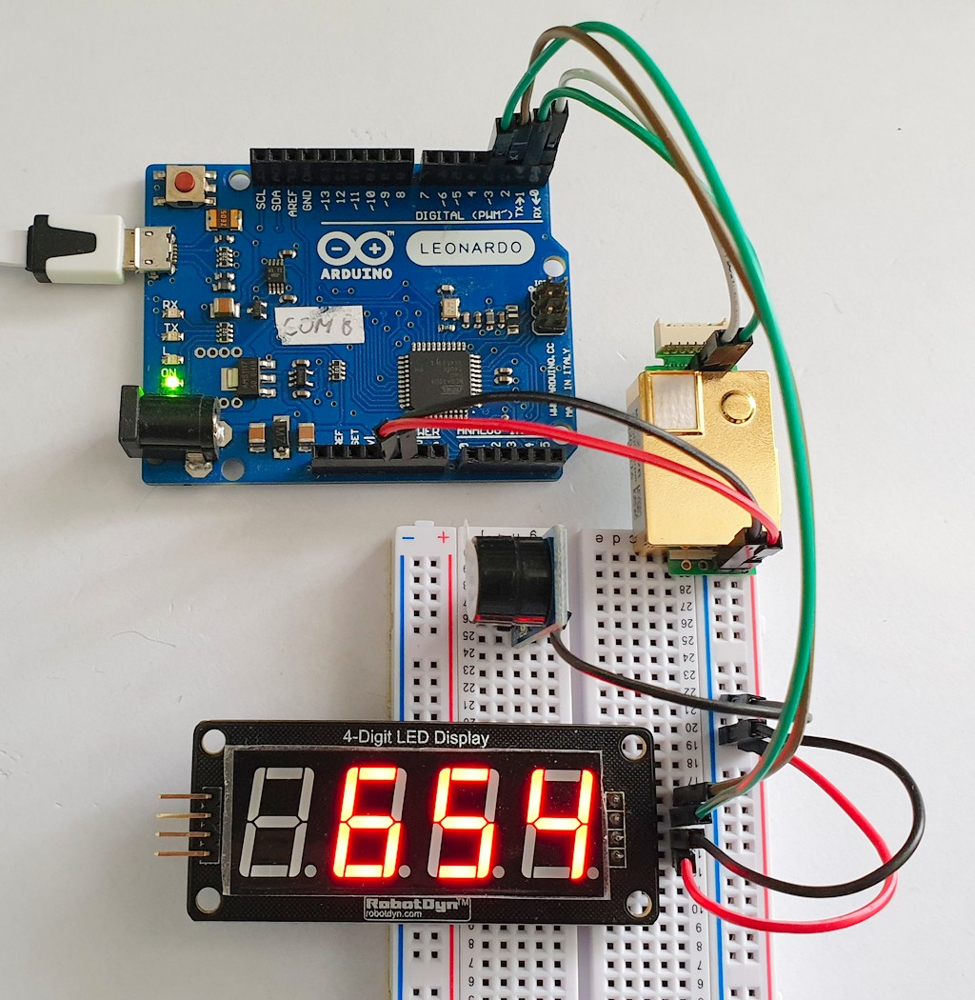
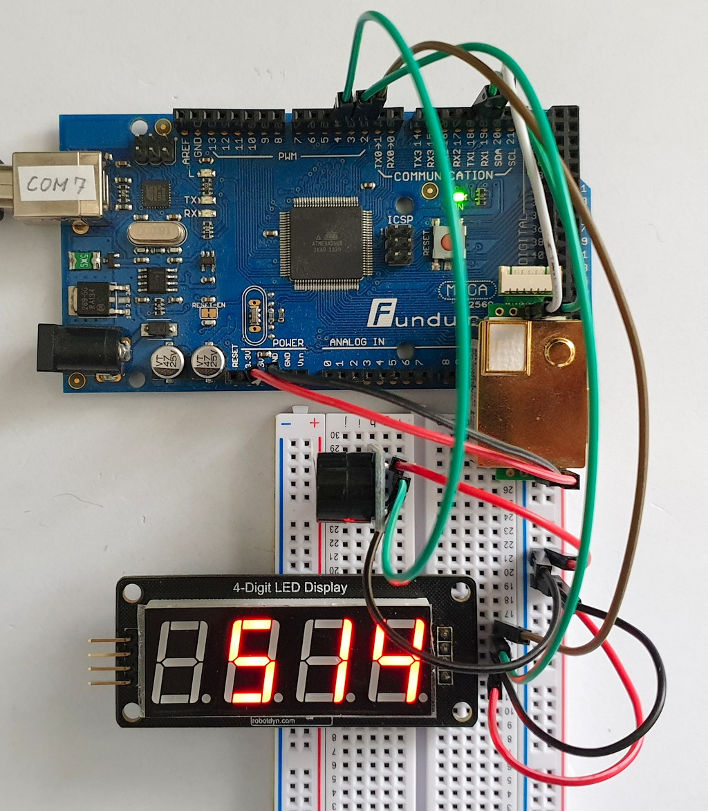
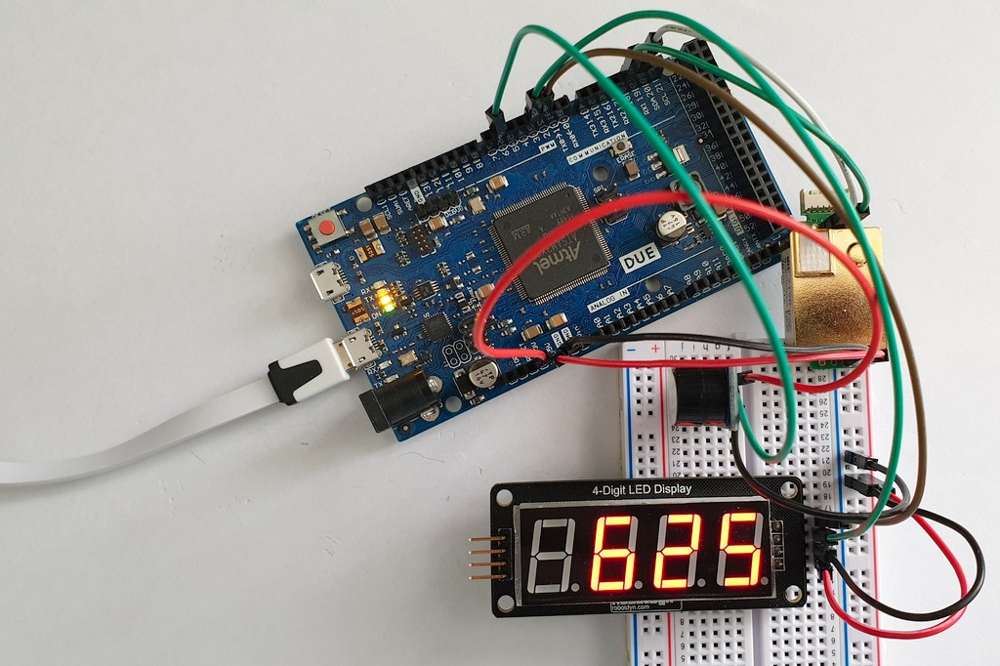

# Erriez MH-Z19B Display and Buzzer Example

CO2 concentration on a 4-digit 7-segment display and buzzer alarm when a high CO2 concentration is detected.

## Usage

* Open [ErriezMHZ19B7SegmentDisplay.ino](https://github.com/Erriez/ErriezMHZ19B/blob/master/examples/ErriezMHZ19B7SegmentDisplay/ErriezMHZ19B7SegmentDisplay.ino).
* Configure pin macro's and connect hardware.
* Flash to target.

Note: Wait at least 3 minutes warming-up time before valid plots are displayed.

## Boards

### Arduino UNO

### ATMega328 Pro Mini 3V3 8MHz

### ESP8266 Wemos D1 mini

### ESP32 Lolin D32

### Leonardo

### ATMega2560

### Atmel DUE Cortex M0

