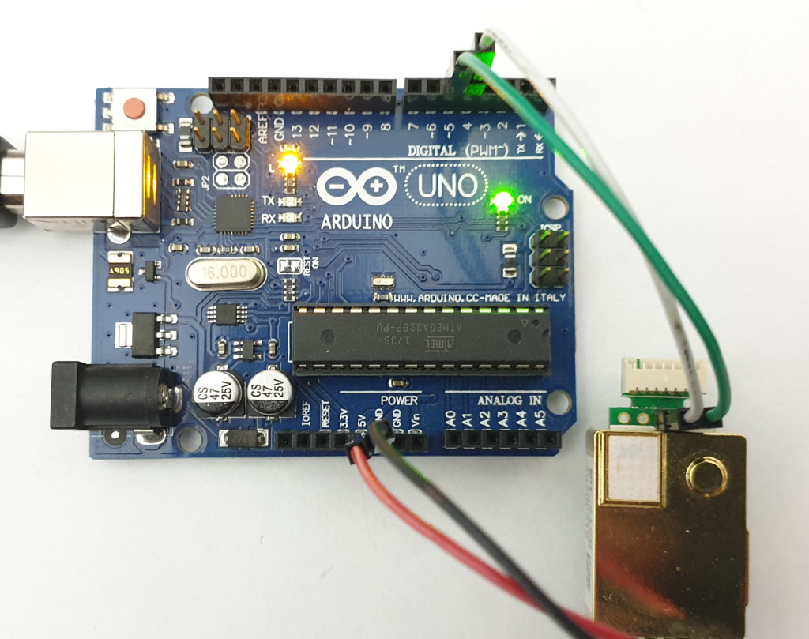
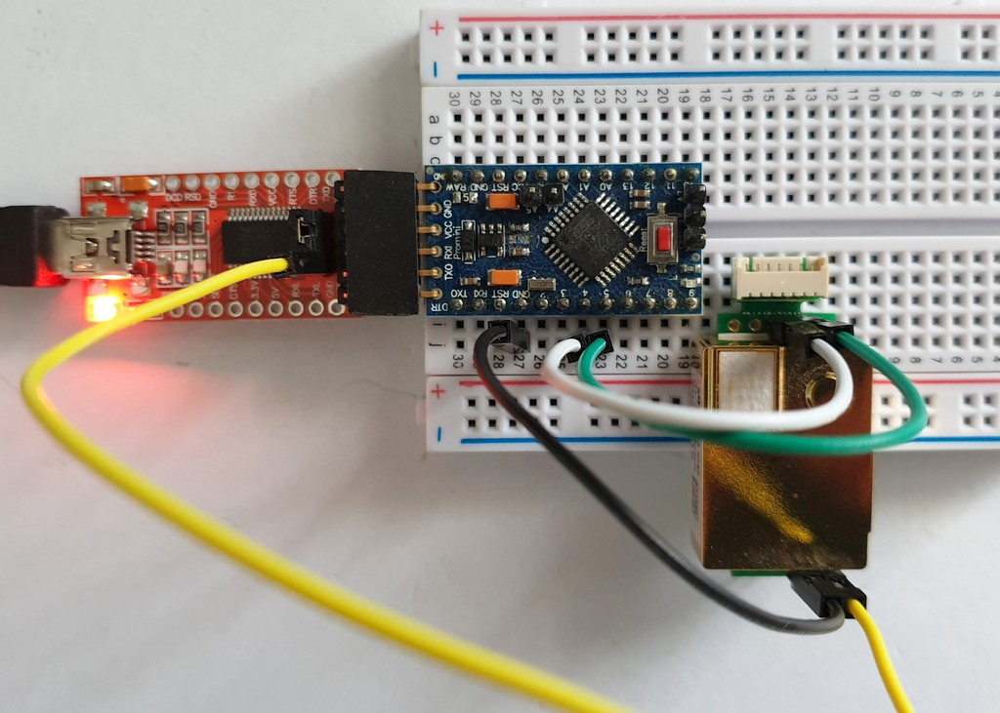
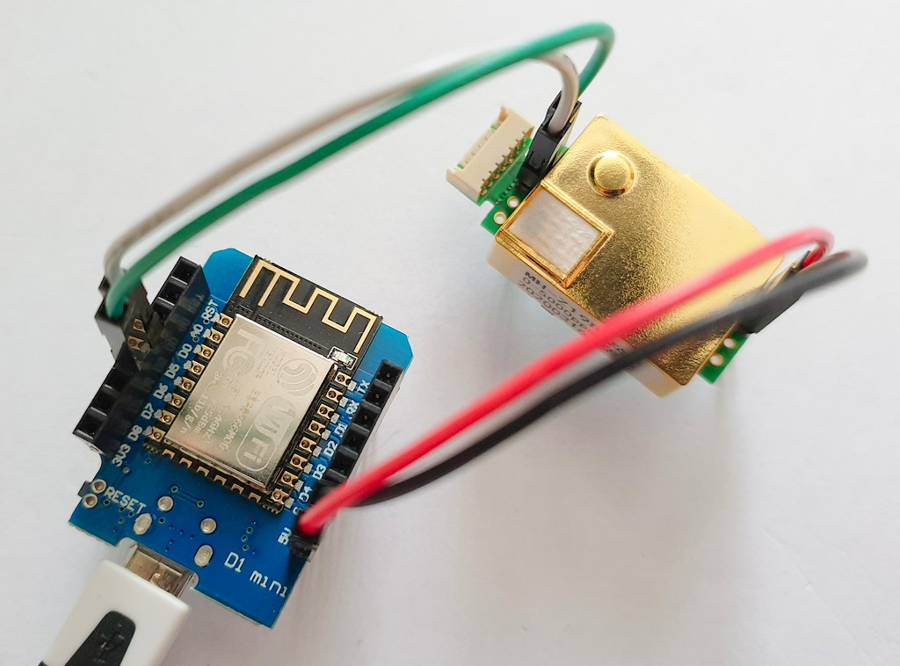
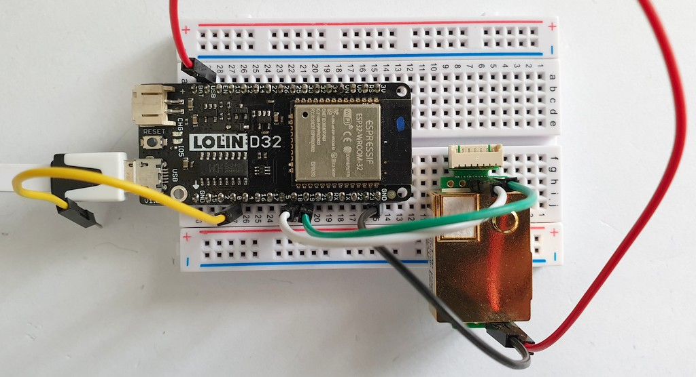
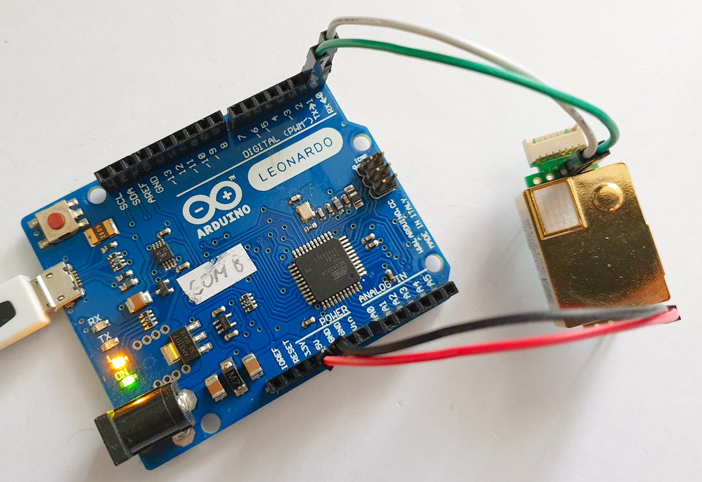
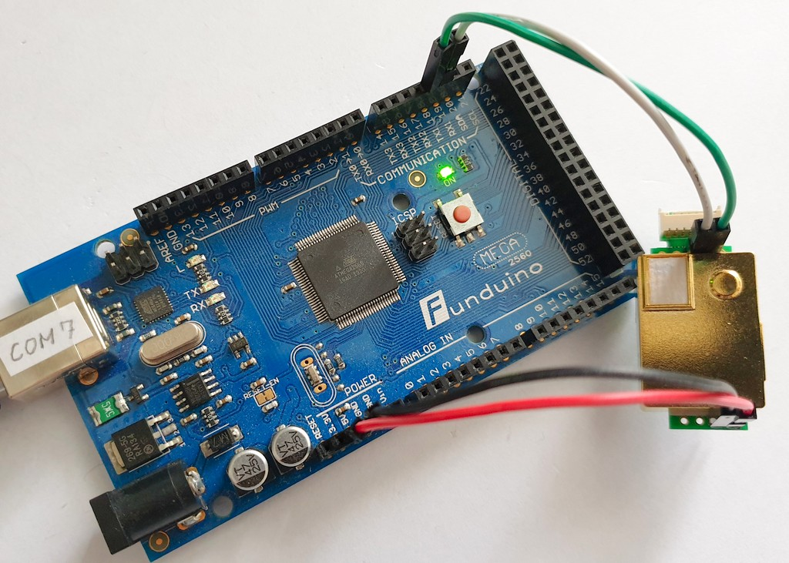
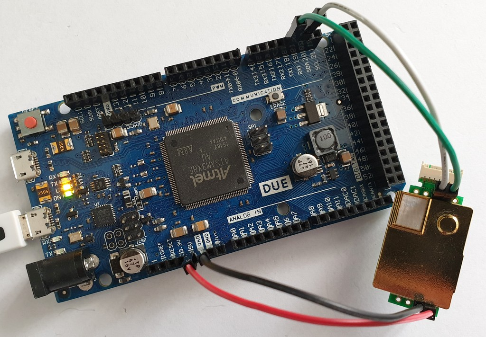

# Erriez MH-Z19B Getting Started Example

Getting started with MH-Z19B CO2 sensor and Arduino board (see pictures below).

## Usage

* Open [ErriezMHZ19BGettingStarted.ino](https://github.com/Erriez/ErriezMHZ19B/blob/master/examples/ErriezMHZ19BGettingStarted/ErriezMHZ19BGettingStarted.ino).
* Configure pin macro's and connect sensor.
* Flash to board.

Note: Wait at least 3 minutes warming-up time before valid plots are displayed.

## Tested boards

### Arduino UNO

### ATMega328 Pro Mini 3V3 8MHz

### ESP8266 Wemos D1 mini

### ESP32 Lolin D32

### Leonardo

### ATMega2560

### Atmel DUE Cortex M0

