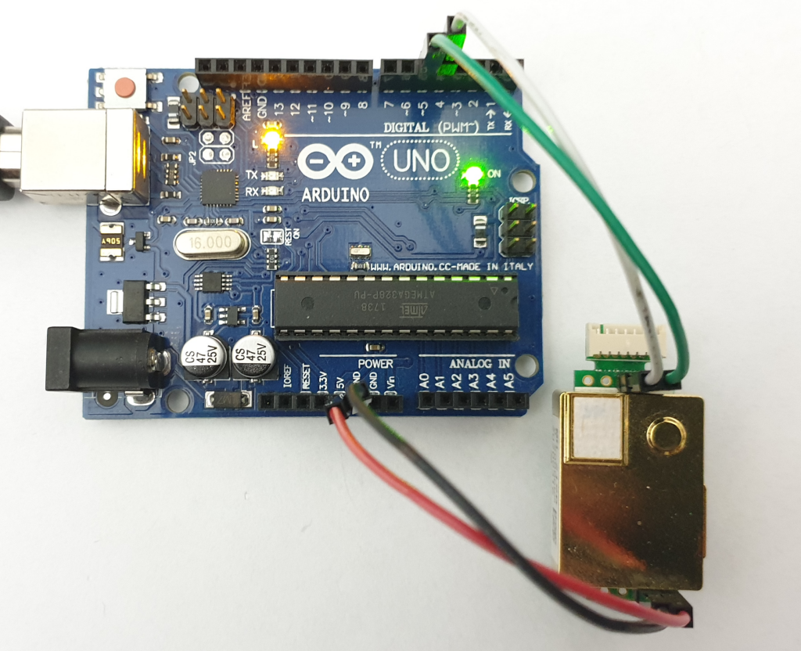

# Erriez MH-Z19B Getting Started Example

Getting started with MH-Z19B CO2 sensor and Arduino UNO:

## Usage

* Configure pin macro's.
* Flash to target.

Note: Wait at least 3 minutes warming-up time before valid plots are displayed.

## Example code

[ErriezMHZ19BGettingStarted.ino](https://github.com/Erriez/ErriezMHZ19B/blob/master/examples/ErriezMHZ19BGettingStarted/ErriezMHZ19BGettingStarted.ino)
